# Enterprise EDR & Threat Hunting Grid : Sentient Shield

### LAB ENVIRONMENT:-
| MACHINE NAME  | ROLE | IP |
| ------------- |:-------------:|:-------------:|
| WAZUH     |  WAZUH INDEXER+MANAGER+DASHBOARD   | 192.168.91.152 |
| WINDOWS      |  WAZUH-AGENT    |  192.168.91.153    |
| UBUNTU     |   WAZUH-AGENT   |  192.168.91.150    |

## Week 1 Infrastructure & Agent Deployment 

#### Objective :- Deploy the Wazuh Manager on a dedicated Linux server. Deploy agents on a test Windows Server and a target Linux Web Server. Install Sysmon on the Windows machine for deep process/network visibility. 

### Installation of Wazuh in UBUNTU_24.04

1. Execute this command on terminal of wazuh server.
```
curl -sO https://packages.wazuh.com/4.14/wazuh-install.sh && sudo bash ./wazuh-install.sh -a
```

NOTE:- Save this part of log which contain your login credential.
```
INFO: --- Summary ---
INFO: You can access the web interface https://<WAZUH_DASHBOARD_IP_ADDRESS>
    User: admin
    Password: <ADMIN_PASSWORD>
INFO: Installation finished.
```

### Installation of Sysmon and Wazuh-agent in Windows_10 system

1. Go to [SYSMON](https://learn.microsoft.com/en-us/sysinternals/downloads/sysmon) and download zip file.
2. Download [CONFIGURATION FILE](https://github.com/olafhartong/sysmon-modular/blob/master/sysmonconfig.xml).
3. Extract zip and move config file in that folder.
4. Open powershell with Admin privilege , Go to that folder location and run following command.
```
.\Sysmon64.exe -accepteula -i sysmonconfig.xml
```
5. Installation of Wazuh-agent in Windows . Execute this command in powershell with Admin privilege
```
New-Item -ItemType Directory -Path "C:\tmp" -Force; Invoke-WebRequest -Uri "https://packages.wazuh.com/4.x/windows/wazuh-agent-4.14.4-1.msi" -OutFile "C:\tmp\wazuh-agent.msi" -UseBasicParsing; msiexec.exe /i "C:\tmp\wazuh-agent.msi" /q WAZUH_MANAGER="192.168.91.152" WAZUH_AGENT_GROUP="default" WAZUH_AGENT_NAME="WINDOWS_10"
```
6. Start the Wazuh-agent services.
```
NET START WazuhSvc
```
7. Open `C:\Program Files (x86)\ossec-agent\ossec.conf` in notepad. Add followig section into local file rule.
```
<localfile>
  <location>Microsoft-Windows-Sysmon/Operational</location>
  <log_format>eventchannel</log_format>
</localfile>
```
8. Restart Wazuh-agent in Windows_10 , Execute this command in powershell with Admin privilege
```
NET STOP WazuhSvc
NET START WazuhSvc
```
9. Check Sysmon and Wazuh-agent services are running perfactly by execute this command.
```
Get-Service Sysmon64
Get-Service WazuhSvc
```
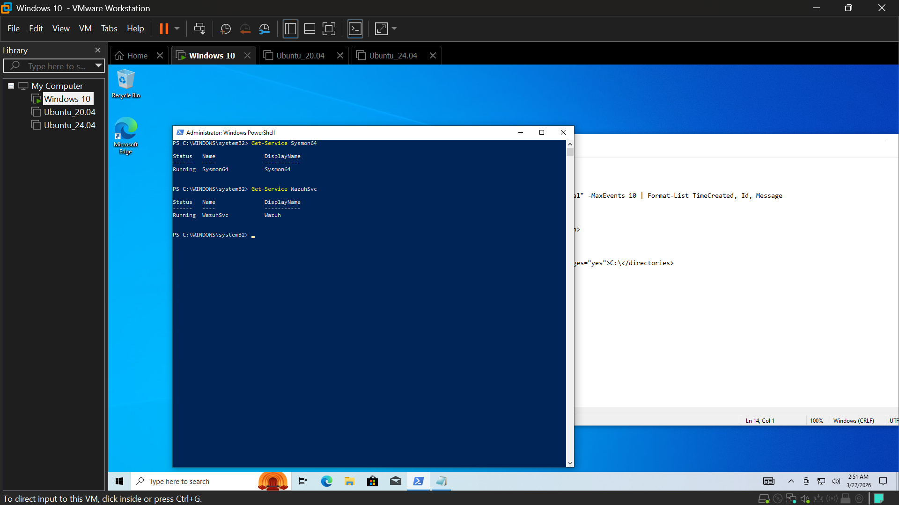

10. Go to agent logs and filter it by `rule.groups: sysmon` to see only sysmon logs in Wazuh-dashboard.

### Installation of Wazuh-agent in ubuntu_20.04

1. Open terminal and run following command.
```
wget https://packages.wazuh.com/4.x/apt/pool/main/w/wazuh-agent/wazuh-agent_4.14.4-1_amd64.deb && sudo WAZUH_MANAGER='192.168.91.152' WAZUH_AGENT_GROUP='UBUNTU' WAZUH_AGENT_NAME='UBUNTU' dpkg -i ./wazuh-agent_4.14.4-1_amd64.deb
```
2. Start the Wazuh-agent services
```
sudo systemctl daemon-reload
sudo systemctl enable wazuh-agent
sudo systemctl start wazuh-agent
```
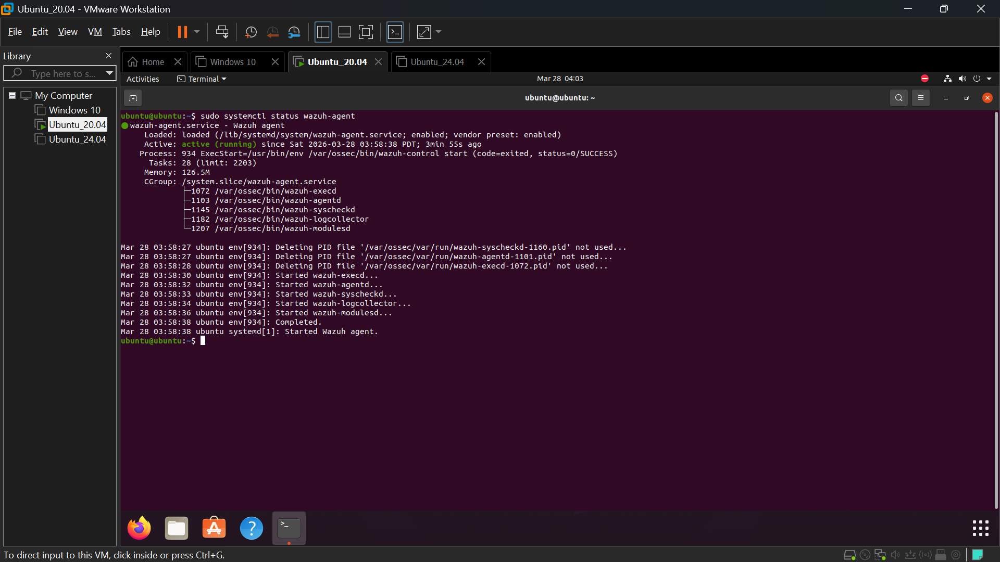

### Go to agent preview tab you can see both agent are in active status now.

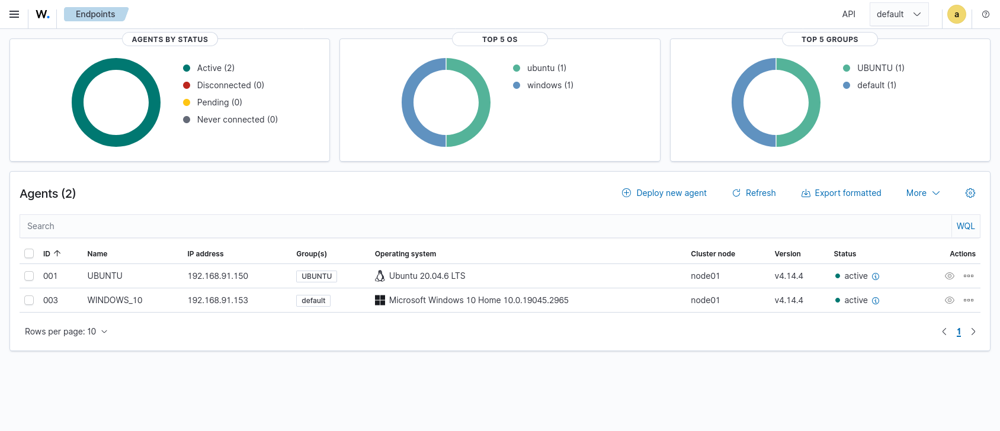

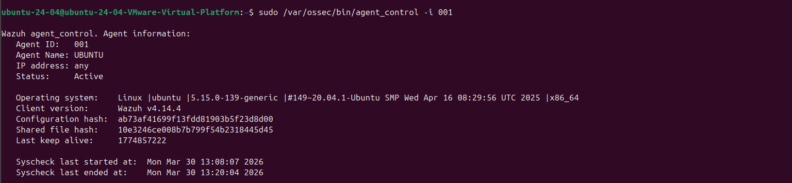

### GATE CHECK:-
| TASKS  | STATUS |
| ------------- |:-------------:|
| WAZUH INSTALLATION      | ✅ Complete     |
| SYSMON+WAZUH-AGENT IN WINDOWS      | ✅ Complete     |
| WAZUH-AGENT IN UBUNTU      | ✅ Complete     |
| ACTIVE STATUS OF BOTH AGENT     | ✅ Complete     |


## Week 2 Detection Rules (The Logic)

#### Objective :- Configure FIM to watch sensitive application directories. Write custom XML decoders and rules for a specific application's proprietary log file format. Enable the "vulnerability Detector" module on the agents.

### Enable File integrity monitoring(FIM) in Ubuntu_20.04
1. Open `/var/ossec/etc/ossec.conf` and add this rule under `<syscheck>` tag and save it.
```
<directories report_changes="yes" realtime="yes" check_all="yes">/home,/root</directories>
```
2. Restart Wazuh-agent services.
```
sudo systemctl restart wazuh-agent
```
### Enable File integrity monitoring(FIM) in WINDOWS_10
1. Open `C:\Program Files (x86)\ossec-agent\ossec.conf` and add this rule under `<syscheck>` tag and save it.
```
<directories report_changes="yes" realtime="yes" check_all="yes">C:\Users\<YOUR-USERNAME>\Desktop,C:\Users\<YOUR-USERNAME>\Documents,C:\Users\<YOUR-USERNAME>\Downloads</directories>
```
2. Restart Wazuh-agent services.
```
NET STOP WazuhSvc
NET START WazuhSvc
```

### Detecting unauthorized tampering of files in both os in configured directory.

1. Create file in configured directory.
2. Modify that file and add some content in that file.
3. Delete that file from configured directory.
4. Go to File integrity monitoring(FIM) tab from left-side navbaar click on agent and go to events .
5. Here you can find your logs of configured directory for File integrity monitoring(FIM).
6. Expand any log and check system difference , hash of files and other details.

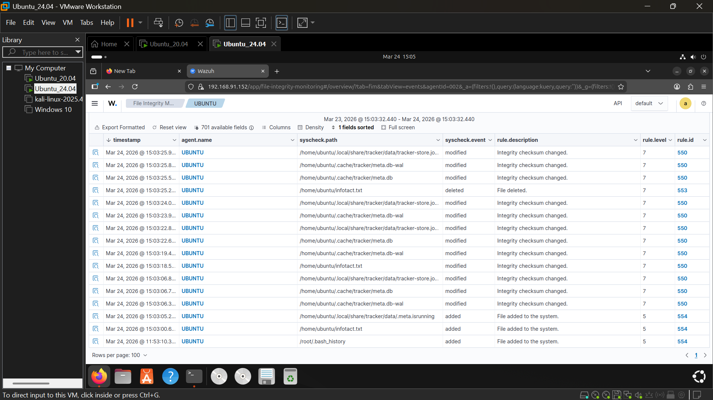
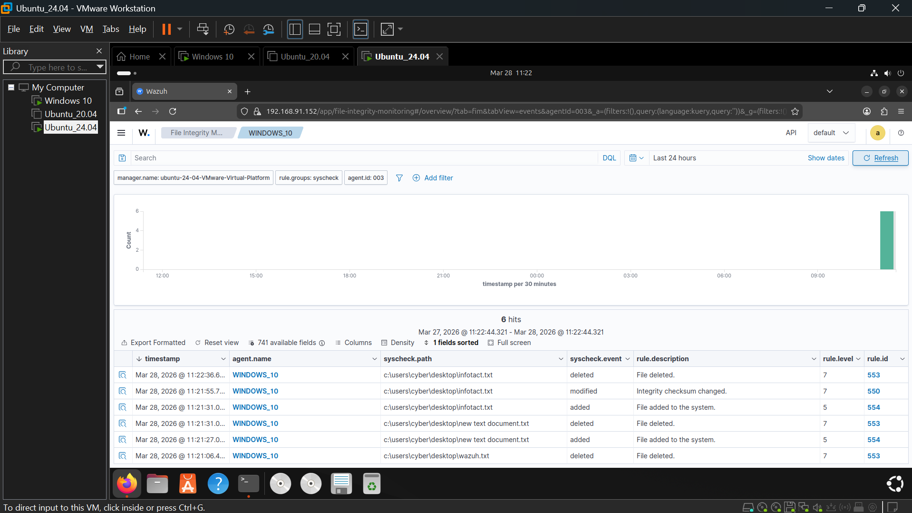
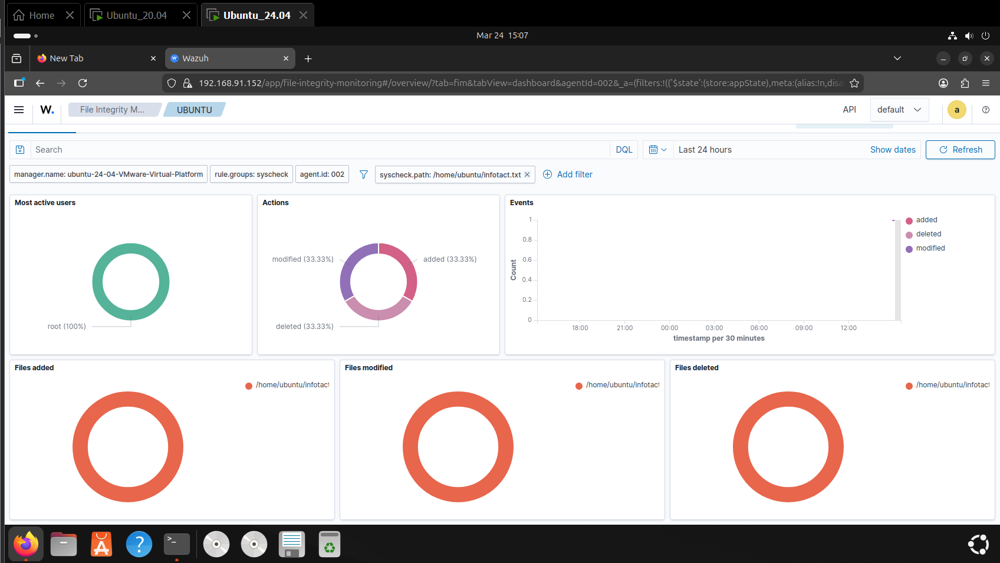

### We got alert within 5 sec you can see following images as a proof.
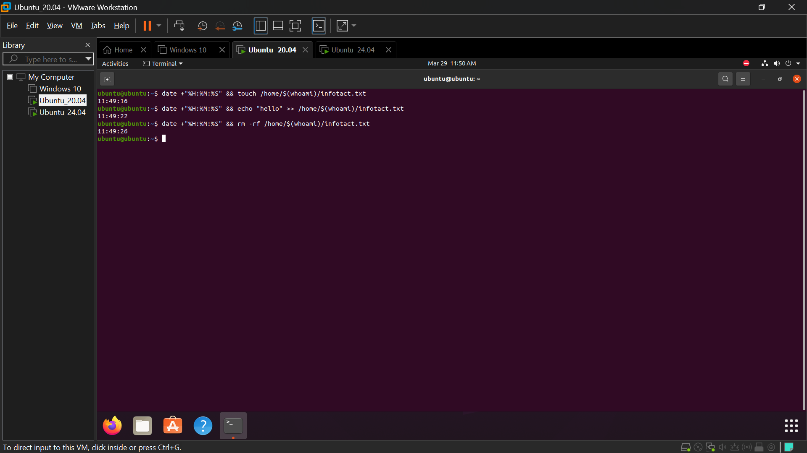
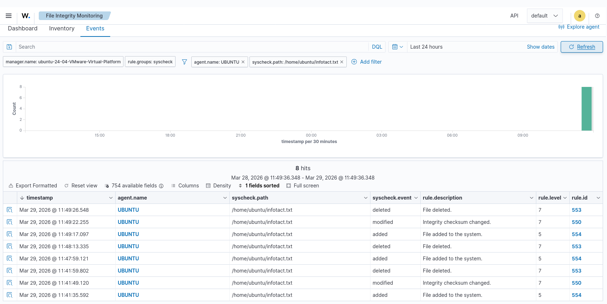

> FIM alert fired at rule level 7 — confirmed in event detail panel see [fim-5s.png](images/fim-5s.png).

### Enable vulnerability detector

1. Add this into `/var/ossec/etc/ossec.conf` in wazuh-manager.
```
<vulnerability-detector>
  <enabled>yes</enabled>
  <interval>12h</interval>
  <min_full_scan_interval>6h</min_full_scan_interval>
  <run_on_start>yes</run_on_start>

  <!-- NVD feed for all OS types -->
  <provider name="nvd">
    <enabled>yes</enabled>
    <update_interval>1h</update_interval>
  </provider>

  <!-- Ubuntu/Debian CVE feed -->
  <provider name="canonical">
    <enabled>yes</enabled>
    <os>focal</os>
    <os>jammy</os>
    <os>noble</os>
    <update_interval>1h</update_interval>
  </provider>

  <!-- Windows CVE feed -->
  <provider name="msu">
    <enabled>yes</enabled>
    <update_interval>1h</update_interval>
  </provider>
</vulnerability-detector>
```
2. Restart the wazuh-manager 
```
sudo systemctl restart wazuh-manager
```
3. Now click on vulnerebility detector on wazuh-dashboard.

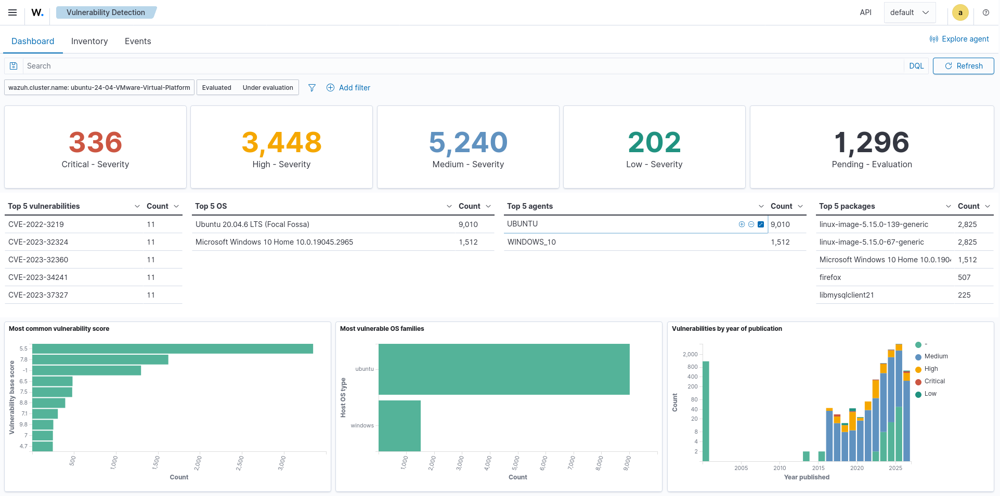
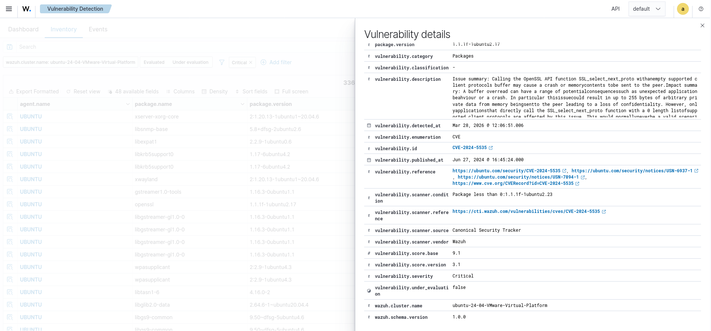

### GATE CHECK:-
| TASKS  | STATUS |
| ------------- |:-------------:|
| FIM CONFIGURATION      | ✅ Complete     |
| FILE TAMPERING DETECTION      | ✅ Complete     |
| ENABLE VULNERABLE DETECTION      | ✅ Complete     |
| EXPLORE AND SOLVE vulnerability    | ✅ Complete     |

## Week 3 Active Response (IPS) 

#### Objective :- Configure active-response scripts. Define the scenario: SSH Brute Force -> Wazuh triggers the firewall-drop command on the target host

### Flow from starting to ending of active response.


### Attack detection and analysis 

1. In your target machine install openssh-server and configure the server to become vulnerable to bruteforce.
2. In your attacker machine install hydra tool and run this command.
```
hydra -l ubuntu -P /usr/share/wordlists/rockyou.txt -t 4 -v ssh://192.168.91.150
```
3. Now go to agent logs you can see description like `sshd: authentication failed` this shown in image.


### Now we are configuring our active response.

1. Open `/var/ossec/etc/ossec.conf` this file in any editor and add following lines in `<active-response>` tag :-
```
  <command>firewall-drop</command>
  <location>local</location>
  <rules_id>5763</rules_id>
  <timeout>3600</timeout>
```
2. Restart your wazuh-manager.
```
sudo systemctl restart wazuh-manager
```
3. Check active-response is enable in your agent configuration.

4. Now re-run hydra command from attacker machine to victim machine .

5. Open Wazuh-agent log you can see description like `Host Blocked by firewall-drop Active Response` this shown in image.
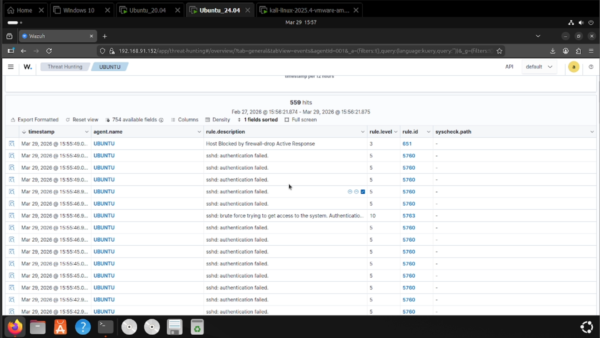

6. You can also verify by analysis of log file at `/var/ossec/logs/alerts/alerts.json` by executing this command :
```
cat /var/ossec/logs/alerts/alerts.log | grep -E "Rule: 651|Rule: 652|Rule: 5763|firewall-drop|192.168.91.133"
```
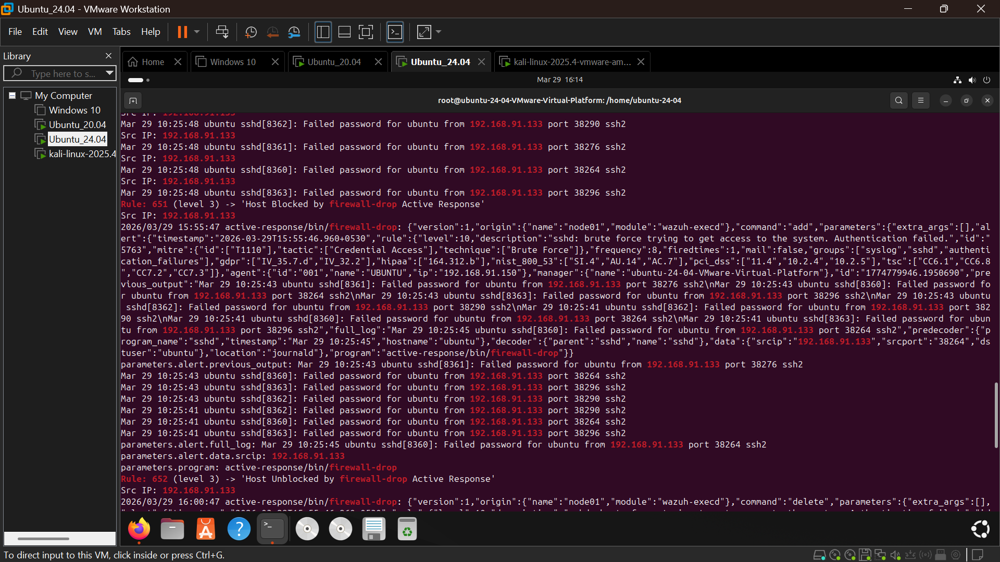

### Summary of whole active response process :-

| Field	| Value |
| ------------- |:-------------:|
|Attacker IP	| 192.168.91.133|
|Victim agent	UBUNTU — | 192.168.91.150 — Agent ID 001|
|Target user |	ubuntu|
|Attack tool|	Hydra — 4 parallel threads on SSH port 22|
|Attack run 1	|10:07:46 → 10:08:03 (first Hydra run)|
|Attack run 2	|10:25:39 → 10:25:48 (second Hydra run — triggered active response)|
|Total failed attempts|	30+ failed password attempts across both runs |
|Ban timeout |	3600 seconds (1 hour)|
|MITRE technique |	T1110 Brute Force — Credential Access|

|Time	| Rule	| Level|	Event	|Action|
| ------------- |:-------------:| ------------- |:-------------:| ------------- |
|10:07:52	|5763	|10	|First brute force detected — 8 failures from 192.168.91.133	| Alert only — no active response yet (not configured at this point)
|10:25:43	|5763	|10	|Second brute force detected — 8 failures from 192.168.91.133	| Triggers active response firewall-drop
|15:55:47	|651	|3	|Host Blocked by firewall-drop Active Response	| command: add — IP banned in iptables on UBUNTU agent
|17:00:47	|652	|3	|Host Unblocked by firewall-drop Active Response	| command: delete — IP removed after exactly 3600 seconds  

### GATE CHECK:-
| TASKS  | STATUS |
| ------------- |:-------------:|
| BRUTE-FORCE DETECTION      | ✅ Complete     |
| ACTIVE-RESPONSE CONFIGURATION      | ✅ Complete     |
| AUTOMATIC BANNED ATTACKER IP     | ✅ Complete     |
| AUTOMATIC UNBANNED IP AFTER 1 HOUR   | ✅ Complete     |

## Week 4 Threat Simulation

#### Objective :- Use the Atomic Red Team framework to simulate a common ransomware attack pattern (e.g., deleting Shadow Volume Copies, T1490). Map and visualize the resulting alerts.

### Create a shadow copy so our test can delete it
```
wmic shadowcopy call create Volume='C:\'

vssadmin list shadows

```

### Install Atomic Red Team on WINDOWS_10

1. Open PowerShell as Administrator and run:
```
Set-ExecutionPolicy Bypass -Scope CurrentUser -Force

IEX (IWR 'https://raw.githubusercontent.com/redcanaryco/invoke-atomicredteam/master/install-atomicredteam.ps1' -UseBasicParsing)

Install-AtomicRedTeam -getAtomics -Force
```
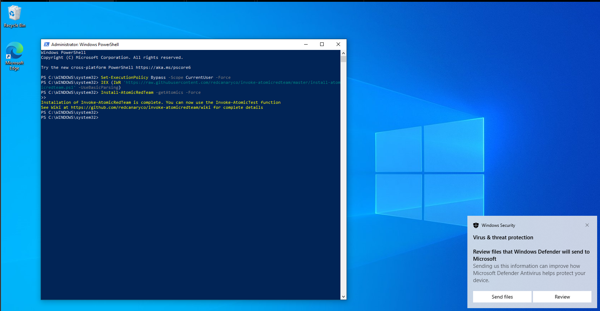

2. After that let's see information of T1490 test.
```
Invoke-AtomicTest T1490 -ShowDetails
```
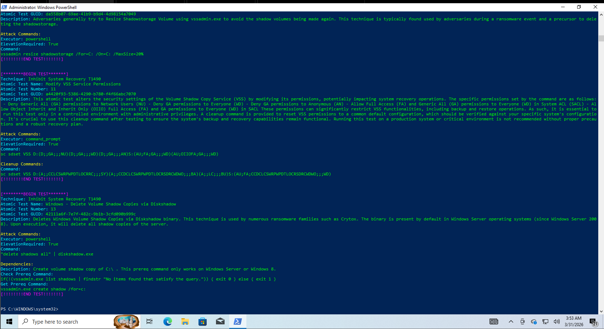

### Run the T1490 mitre att&ck

1. Run the T1490 test
```
Invoke-AtomicTest T1490 -TestNumbers 1
```

### Open wazuh-dashboard then click on MITRE ATT&CK section . You can see activity here.

#### All MITRE ATT&CK TACTICS i found in my wazuh-dashboard.
| Time | Stage | Technique |Description |
| ------------- |:-------------:|:-------------:|:-------------|
|19:54:28 |Persist|T1543.003|New Windows services created in registry|
|19:54:34|Execute|T1059.003|cmd.exe launched by abnormal parent process|
|19:54:39|Evade|T1070.004|PowerShell used to delete files/directories|
|20:20:44|C2|T1105|PowerShell downloading ART atomic scripts|
|20:22:57|Lateral|T1570|Executable dropped in Windows root folder|
|20:23:44|PrivEsc|T1574.001/002|DLL search order hijack — multiple DLLs in Windows root|
|20:25:24|Persist|T1053.005|taskschd.dll loaded — scheduled task creation|
|20:26:05|Execute|T1087 + T1059.003|Account discovery + cmd shell execution|

### Kill Chain Visualization in OpenSearch Dashboard

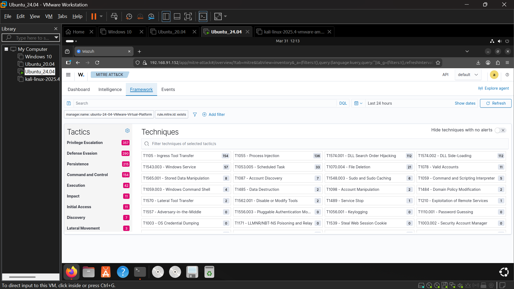
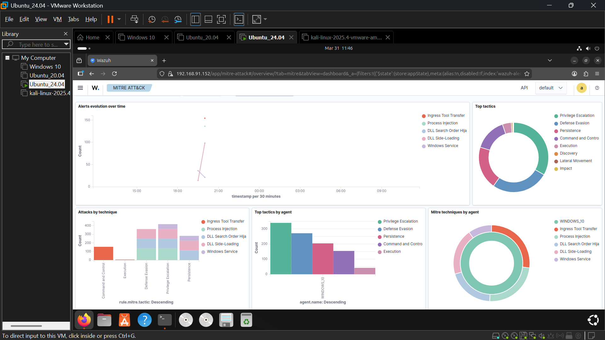
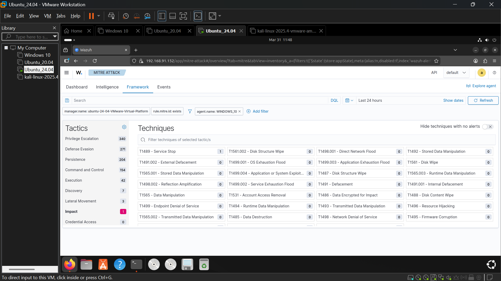
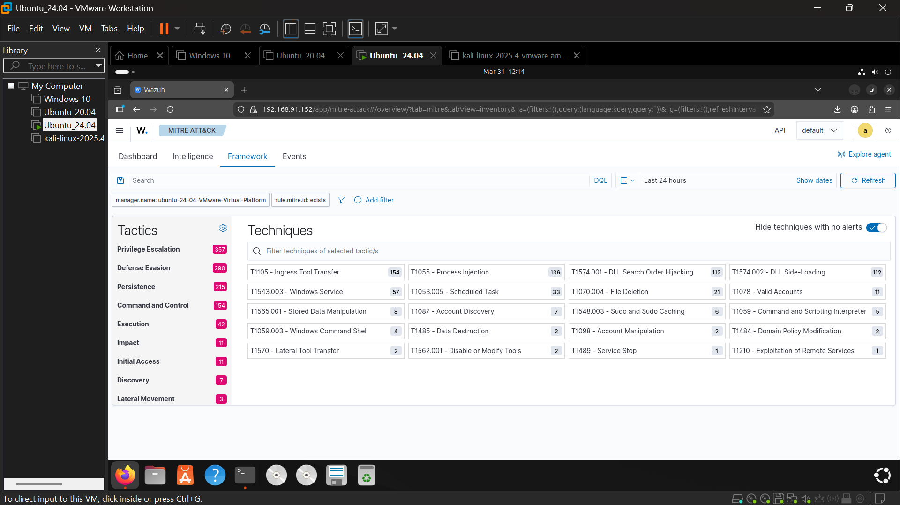

### Summary of whole processes found from logs. 

|Kill Chain Stage	| MITRE Tactic | Count	| Key Techniques Found |
| ------------- |:-------------:|:-------------:|:-------------|
|1 — Initial foothold	| Command & Control	| 154+	|T1105 — Ingress Tool Transfer (ART downloading atomics via PowerShell) |
|2 — Execution	| Execution	| 42	| T1059.003 — cmd shell, T1053.005 — Scheduled Task, T1059.001 — PowerShell |
|3 — Persistence	| Persistence	| 204	| T1543.003 — Windows Service creation, T1053.005 — Task Scheduler |
|4 — Privilege Escalation	| Privilege Escalation	| 340	| T1574.001 — DLL Search Order Hijack, T1574.002 — DLL Side-Loading |
|5 — Defense Evasion	| Defense Evasion	| 271	| T1574.001/002 — DLL hijack, T1070.004 — File Deletion via PowerShell |
|6 — Discovery	| Discovery	| 7	| T1087 — Account Discovery|
|7 — Lateral Movement	| Lateral Movement	| 3	| T1570 — Executable dropped in Windows root folder |
|8 — Impact	| Impact	| 1	| T1489 — Service Stop (ransomware pattern)|

### GATE CHECK:-
| TASKS | STATUS |
| ------------- |:-------------:|
| ATOMIC RED TEAM INSTALLED | ✅ Complete |
| RANSOMWARE PATTERN SIMULATED (ART) | ✅ Complete |
| 500+ WAZUH ALERTS CAPTURED | ✅ Complete |
| 8 MITRE TACTICS DETECTED IN SEQUENCE | ✅ Complete |
| IMPACT STAGE DETECTED (T1489 — Service Stop) | ✅ Complete |
| KILL CHAIN VISUALIZATION IN OPENSEARCH | ✅ Complete |

## Final thought :- Through building Sentient Shield, I gained practical experience in designing and implementing a real-world Security Operations Center (SOC) detection and response system.

### I learned how to:
1. Deploy and manage an endpoint detection system using Wazuh
2. Monitor system activity and detect threats using Sysmon
3. Implement File Integrity Monitoring (FIM) to detect unauthorized system changes
4. Map security events to adversary behavior using the MITRE ATT&CK framework
5. Build and tune detection rules to identify real attack patterns
6. Automate incident response actions to reduce reaction time
7. Simulate real-world attacks using Atomic Red Team to validate detection capabilities
